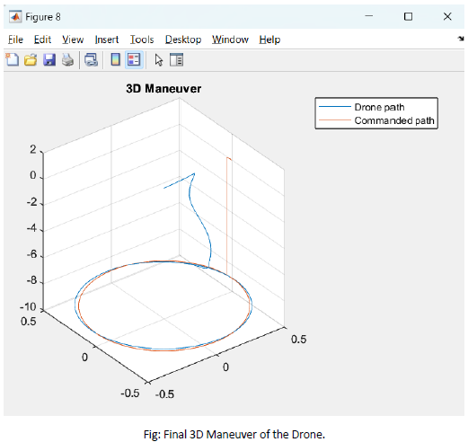

# Octocopter Simulation and Control Model

## Project Overview
This project simulates the dynamics and control system of an **octocopter drone** using **MATLAB** and **Simulink**. The model includes a multi-variable control system with **PID** and **PD controllers** to handle altitude, roll, pitch, and yaw adjustments, ensuring stability and precise movement in 3D space.

## Features
- **Comprehensive Octocopter Dynamics**: Full simulation of octocopter dynamics, with thrust and torque effects modeled for each rotor.
- **Advanced Control System**: PID and PD controllers manage stability across altitude, roll, pitch, and yaw.
- **3D Trajectory Simulation**: Defined parametric equations simulate circular flight paths with altitude variations.
- **Realistic Sensor Simulation**: Includes simulated GPS and other sensors for accurate feedback to controllers.

## Simulation Details
- **Control Equations and Dynamics**: The model incorporates complex equations for forces, moments, and rotations, providing a realistic flight experience.
- **Trajectory Path**: Simulates a circular path at a 9-meter altitude with a 0.5-meter radius at 0.1 rad/s.

### Key Parameters:
- **Gravity**: 9.81 m/s²
- **Drone Mass**: 4.34 kg
- **Thrust Coefficient**: 1.2953e-5 Ns²
- **Rotor Arm Length**: 0.315 m
- **Moments of Inertia**: Ixx = 0.0820 kg·m², Iyy = 0.0845 kg·m², Izz = 0.1377 kg·m²

## Control Implementation
- **Altitude Control**: A PD controller stabilizes the octocopter at a 9-meter height.
- **Roll, Pitch, and Yaw Control**: PID controllers enable precise orientation adjustments.
- **Trajectory Generation**: A parametric equation defines circular motion, simulating complex spatial maneuvers.

## Results and Visualization
- **Altitude, Roll, Pitch, and Yaw Plots**: Visualize the octocopter's stability and responsiveness.
- **3D Maneuver Path**: The plot below shows the octocopter’s path in comparison with the commanded circular trajectory.



## Getting Started
To run this project, you’ll need MATLAB and Simulink installed.

### Installation
1. **Clone this repository**:
   ```bash
   git clone https://github.com/JuneshG/Octocopter
